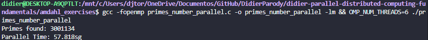

# Amdhal exercises

## Task 1:

I have 4 phisical cores and 8 logical cores on my machine, means that  my processor has 4 cores and each one can use 2 logical cores.

## Task 2:

$$
SpeeUp = Ts / Tp  
$$

### On my machine:

*Parallel time:*

*Sequential time:*

$$
\text{Speedup} = \frac{136.167\ \text{s}}{50.399\ \text{s}} \approx 2.7018
$$

## Task 3:

$$
P = \frac{N\,(S-1)}{S\,(N-1)}
$$

- S: 26888.2 s.
- N = 6.

$$
P = \frac{N\,(S-1)}{S\,(N-1)} = \frac{12\,(2.7018-1)}{2.7018\,(12-1)} = \frac{12 \times 1.7018}{2.7018 \times 11}
$$

$$
P = \frac{20.4216}{29.7198} \approx \boxed{0.6871}
$$

$$
P \approx \boxed{0.6871}
$$

## Task 4

$$
S(N) = \frac{1}{(1-P) + \frac{P}{N}}, \qquad P = 0.85 \;\Rightarrow\; 1-P = 0.15
$$

$$
S(N) = \frac{1}{0.15 + \frac{0.85}{N}}
$$

calculate N:

$$
\begin{aligned}S(1)  &= \frac{1}{0.15 + \frac{0.85}{1}}  = \frac{1}{0.15 + 0.85}     = \frac{1}{1.00000}  = 1.00 \\[6pt]S(2)  &= \frac{1}{0.15 + \frac{0.85}{2}}  = \frac{1}{0.15 + 0.425}    = \frac{1}{0.575}    \approx 1.74 \\[6pt]S(4)  &= \frac{1}{0.15 + \frac{0.85}{4}}  = \frac{1}{0.15 + 0.2125}   = \frac{1}{0.3625}   \approx 2.76 \\[6pt]S(6)  &= \frac{1}{0.15 + \frac{0.85}{6}}  \approx \frac{1}{0.15 + 0.14167} \approx \frac{1}{0.29167} \approx 3.43 \\[6pt]S(12) &= \frac{1}{0.15 + \frac{0.85}{12}} \approx \frac{1}{0.15 + 0.07083} \approx \frac{1}{0.22083} \approx 4.53\end{aligned}
$$

Limit with an infinite number of processors:

$$
\lim_{N \to \infty} \frac{P}{N} = 0
$$

$$
S_\infty = \frac{1}{1-P} = \frac{1}{0.15} \approx 6.67
$$

## Task 5:

- `N = 1`:
    - 
    
    
    
- `N = 2` :
    - 
    
    
    
- `N = 4` :
    - 
    
    
    
- `N = 6` :
    - 
    
    
    
- `N = 12` :
    - 
    
    
    

### Experimental speedup:

$$
S_{\text{exp}}(N) = \frac{T(1)}{T(N)}
$$

$$
\begin{aligned}S(1)  &= \frac{136.167}{133.593} \approx 1.0193 \\[6pt]S(2)  &= \frac{136.167}{89.765}  \approx 1.5169 \\[6pt]S(4)  &= \frac{136.167}{66.149}  \approx 2.0585 \\[6pt]S(6)  &= \frac{136.167}{57.818}  \approx 2.3551 \\[6pt]S(12) &= \frac{136.167}{50.399}  \approx 2.7018\end{aligned}
$$

**More threads reduce the time required to perform the operations.**

---

#### Observations:

Ahora si en español, Profe, no sé si fue  adrede pero tuve inconvenientes para llegar a una buena respuesta de los ejercicios, debido a que el N en las dos versiones del código(secuencial y paralelo) eran diferentes, en la versión secuencial  teníamos `N =50000000`  y en la versión paralela `N = 50000` lo cual no permitía una correcta comparación en mismas condiciones. Yo cambié el N de paralela a `N = 50000000` .